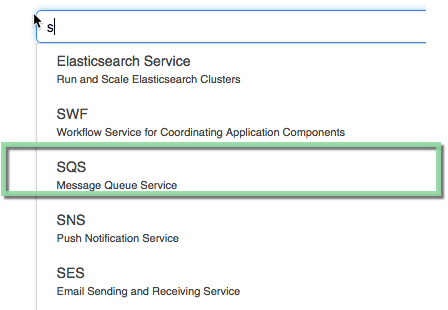
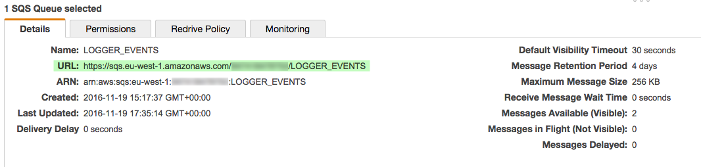
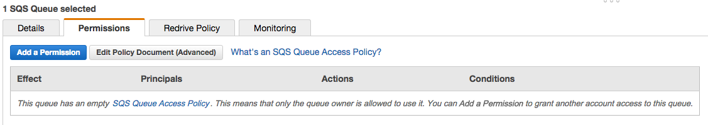
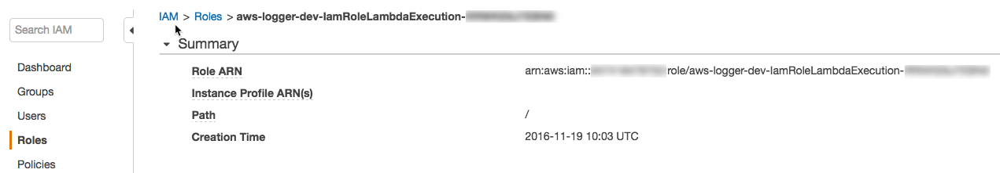

# SQS Setup

We only need to do three things to configure SQS:

- Add a Queue
- Set permissions on Queue
- Set "stage" parameters for your environments (aka., _dev_, _prod_, etc.)

## Add Queue

While it's possible that in some high scale situations there may be benefits to splitting the incoming events into 
more than one queue, however, in all but the most demanding environments the immediate horizontal scalability of Lambda and SQS mean that a single queue is all that's needed for this service in 99% of cases. This queue we'll call: 

- **LOGGER_EVENTS** - this will recieved the unprocessed events from leaf nodes. This is traditional log nodes like `info`, `warn`, and `error` messages but also includes `performance`, `workflow`, and `context` events.

Creating a Queue is super easy. Once you're logged into your AWS console just go to the SQS console:

And then click on the shiny blue button called "create new queue":

You'll give it the LOGGER_EVENTS name (although in reality there's nothing preventing you from calling it anything you please). The remaining defaults are fine. Once added, move back to the "details" tab at the bottom of the screen and take note of the "URL" parameter:

 

Ok, queue setup. Nice work so far. Now let's setup the permissions.

## Set Permissions

As is illustrated below, by default SQS gives no permissions:

We want to keep permissions to a minimum but the default is a bridge too far. Here's what we want:

- **`receiver`** lambda function should be able to use the `sendMessage` function; nothing else needed
- **`processor`** lambda function should be able to `receiveMessage` and `deleteMessage`

For this next step you'll want two browser tabs open:
1. One to the SQS Console,
1. and a second to the IAM console. 

Starting with IAM, navigate to the "Roles" submenu. In the list of roles you'll see that each Lambda function is assigned a role:

Copy the **Role ARN** value and then move over to the SQS console. Again move to the Permissions tab and press the "Add a Permission" button. 

